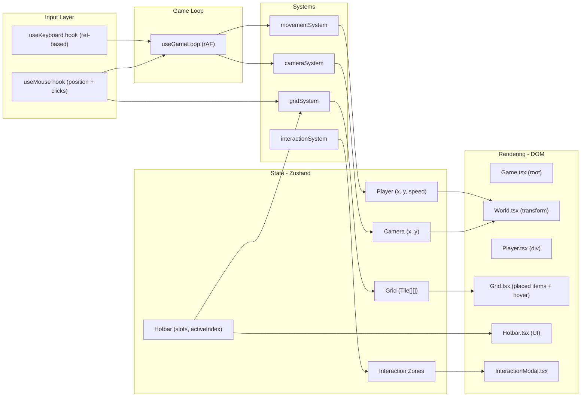

# Grid-Based Game Engine in React

## Current State

Fresh Vite 8 + React 19 + TypeScript project. The existing `App.tsx` and CSS files will be replaced with the game engine. No additional dependencies installed yet.

## Architecture Overview




## Constants (used everywhere)

These go in `src/types/index.ts` or a dedicated `src/constants.ts`:

- `TILE_SIZE = 32` -- pixels per grid cell
- `WORLD_WIDTH = 3000` -- world width in pixels
- `WORLD_HEIGHT = 3000` -- world height in pixels
- `PLAYER_SPEED = 3` -- pixels per frame
- `PLAYER_SIZE = 32` -- player div width/height in pixels
- `EDGE_THRESHOLD = 200` -- pixels from viewport edge before camera starts scrolling
- `HOTBAR_SLOTS = 8` -- number of hotbar slots
- `GRID_COLS = Math.ceil(WORLD_WIDTH / TILE_SIZE)` -- ~94 columns
- `GRID_ROWS = Math.ceil(WORLD_HEIGHT / TILE_SIZE)` -- ~94 rows

---

## Phase 1A: Project Setup (detailed)

### 1. Install Zustand

Run `bun install zustand`.

### 2. Create folder structure

Create these empty directories under `src/`:

- `src/components/`
- `src/hooks/`
- `src/systems/`
- `src/store/`
- `src/types/`
- `src/styles/`

### 3. Define TypeScript types in `[src/types/index.ts](src/types/index.ts)`

```typescript
export type Player = {
  x: number;       // world-space pixel position
  y: number;
  speed: number;
};

export type Camera = {
  x: number;       // top-left corner of viewport in world-space
  y: number;
};

export type Tile = {
  itemId: string | null;   // null = empty cell
};

export type Hotbar = {
  slots: (string | null)[];  // 8 slots, each holds an item type string or null
  activeIndex: number;       // 0-7
};

export type InteractionZone = {
  id: string;
  x: number;       // world-space position
  y: number;
  width: number;
  height: number;
  question: string;
};

export type GameState = {
  player: Player;
  camera: Camera;
  grid: Tile[][];
  hotbar: Hotbar;
  interactionZones: InteractionZone[];
  activeModal: InteractionZone | null;

  // Actions
  setPlayer: (player: Player) => void;
  setCamera: (camera: Camera) => void;
  setGridTile: (row: number, col: number, tile: Tile) => void;
  setHotbarActive: (index: number) => void;
  setActiveModal: (zone: InteractionZone | null) => void;
};
```

### 4. Replace `[src/App.tsx](src/App.tsx)`

Strip all existing content. Replace with:

```typescript
import { Game } from './components/Game';
import './styles/game.css';

function App() {
  return <Game />;
}

export default App;
```

### 5. Replace `[src/index.css](src/index.css)`

Remove all existing Vite starter styles. Replace with minimal reset.

### 6. Delete `[src/App.css](src/App.css)` -- no longer needed.

### 7. Create `[src/styles/game.css](src/styles/game.css)`

```css
* { margin: 0; padding: 0; box-sizing: border-box; }

html, body, #root {
  width: 100vw;
  height: 100vh;
  overflow: hidden;
}

.game-container {
  position: relative;
  width: 100%;
  height: 100%;
  overflow: hidden;
  background: #1a1a2e;
}

.world {
  position: absolute;
  width: 3000px;
  height: 3000px;
  /* camera transform applied via inline style: transform: translate(-camX, -camY) */
}

.player {
  position: absolute;
  width: 32px;
  height: 32px;
  background: #4a9eff;
  border-radius: 4px;
  z-index: 10;
  pointer-events: none;
}

.grid-item {
  position: absolute;
  width: 32px;
  height: 32px;
  border-radius: 2px;
  z-index: 5;
}

.hover-highlight {
  position: absolute;
  width: 32px;
  height: 32px;
  background: rgba(255, 255, 255, 0.15);
  border: 1px solid rgba(255, 255, 255, 0.3);
  pointer-events: none;
  z-index: 8;
}

.hotbar {
  position: fixed;
  bottom: 20px;
  left: 50%;
  transform: translateX(-50%);
  display: flex;
  gap: 4px;
  z-index: 100;
  padding: 6px;
  background: rgba(0, 0, 0, 0.7);
  border-radius: 8px;
}

.hotbar-slot {
  width: 48px;
  height: 48px;
  border: 2px solid rgba(255, 255, 255, 0.2);
  border-radius: 4px;
  display: flex;
  align-items: center;
  justify-content: center;
  color: #fff;
  font-size: 12px;
  position: relative;
  background: rgba(255, 255, 255, 0.05);
}

.hotbar-slot.active {
  border-color: #4a9eff;
  background: rgba(74, 158, 255, 0.15);
}

.hotbar-slot .key-hint {
  position: absolute;
  top: 2px;
  left: 4px;
  font-size: 10px;
  opacity: 0.5;
}

.modal-overlay {
  position: fixed;
  inset: 0;
  background: rgba(0, 0, 0, 0.6);
  display: flex;
  align-items: center;
  justify-content: center;
  z-index: 200;
}

.modal-content {
  background: #2a2a3e;
  padding: 32px;
  border-radius: 12px;
  color: #fff;
  min-width: 400px;
  max-width: 90vw;
}

.modal-content input {
  width: 100%;
  padding: 8px 12px;
  margin-top: 16px;
  border: 1px solid rgba(255, 255, 255, 0.2);
  border-radius: 6px;
  background: rgba(0, 0, 0, 0.3);
  color: #fff;
  font-size: 16px;
}

.modal-content button {
  margin-top: 12px;
  padding: 8px 20px;
  border: none;
  border-radius: 6px;
  background: #4a9eff;
  color: #fff;
  cursor: pointer;
  font-size: 14px;
}
```

---

## Phase 1B: Core Engine (detailed)

### 1. Build `[src/hooks/useKeyboard.ts](src/hooks/useKeyboard.ts)`

- Use a `useRef<Record<string, boolean>>({})` to track pressed keys.
- Attach `keydown` and `keyup` listeners to `window` in a `useEffect`.
- On `keydown`: set `keys.current[e.key.toLowerCase()] = true`.
- On `keyup`: set `keys.current[e.key.toLowerCase()] = false`.
- Return the ref (not state -- avoids re-renders every keypress).
- Clean up listeners on unmount.

### 2. Build `[src/hooks/useGameLoop.ts](src/hooks/useGameLoop.ts)`

- Accept a `callback: (deltaTime: number) => void` parameter.
- Inside `useEffect`, run a `requestAnimationFrame` loop.
- Track `lastTime` via a ref. On each frame, compute `deltaTime = (now - lastTime) / 16.67` (normalize to ~60fps baseline so movement is frame-rate independent).
- Call `callback(deltaTime)` each frame.
- Cancel the animation frame on cleanup.
- Wrap `callback` with `useCallback` at the call site, **not** inside this hook. The hook should use a ref to always call the latest callback (avoids stale closure):

```typescript
const callbackRef = useRef(callback);
callbackRef.current = callback;
// in the loop: callbackRef.current(dt);
```

### 3. Build `[src/systems/movementSystem.ts](src/systems/movementSystem.ts)`

Pure function, no React:

```typescript
export function updatePlayerPosition(
  player: Player,
  keys: Record<string, boolean>,
  deltaTime: number
): Player
```

- Read `keys["w"]`, `keys["s"]`, `keys["a"]`, `keys["d"]` to compute `dx`, `dy` (-1, 0, or +1 each).
- If both dx and dy are nonzero, normalize: divide each by `Math.sqrt(2)` so diagonal speed equals cardinal speed.
- Compute new `x = player.x + dx * player.speed * deltaTime`, same for `y`.
- Clamp to world bounds: `x` in `[0, WORLD_WIDTH - PLAYER_SIZE]`, `y` in `[0, WORLD_HEIGHT - PLAYER_SIZE]`.
- Return new player object (immutable update).

### 4. Build `[src/store/gameState.ts](src/store/gameState.ts)`

Zustand store with `create<GameState>()`:

- `player: { x: 1500, y: 1500, speed: PLAYER_SPEED }` -- start at world center.
- `camera: { x: 0, y: 0 }`.
- `grid`: initialize as 2D array of `GRID_ROWS x GRID_COLS`, all tiles `{ itemId: null }`.
- `hotbar: { slots: Array(8).fill(null), activeIndex: 0 }`. Pre-fill a few slots with placeholder item IDs like `"wood"`, `"stone"`, `"brick"` for testing.
- `interactionZones`: start with 1-2 hardcoded test zones.
- `activeModal: null`.
- Actions: `setPlayer`, `setCamera`, `setGridTile`, `setHotbarActive`, `setActiveModal`.

For `setGridTile`, use immer-style update or manual spread:

```typescript
setGridTile: (row, col, tile) => set((state) => {
  const newGrid = state.grid.map((r, ri) =>
    ri === row ? r.map((c, ci) => (ci === col ? tile : c)) : r
  );
  return { grid: newGrid };
}),
```

### 5. Build `[src/components/Game.tsx](src/components/Game.tsx)`

This is the top-level orchestrator:

- Call `useKeyboard()` to get keys ref.
- Call `useGameLoop(tick)` where `tick` is a `useCallback` that:
  1. Reads `keys.current`.
  2. Calls `updatePlayerPosition(...)` from movementSystem.
  3. Calls `useGameStore.getState().setPlayer(newPlayer)` (use `getState()` to avoid subscribing in the loop).
- Render: `<div className="game-container">` containing `<World />` and `<Hotbar />`.
- If `activeModal` is set, also render `<InteractionModal />`.

**Important**: The game loop must NOT use React state for per-frame updates. Use `store.getState()` and `store.setState()` directly inside the rAF callback to avoid re-rendering React on every frame. Components that need to display game state (World, Player) subscribe to Zustand selectors and React handles their re-renders automatically via Zustand's subscription model.

### 6. Build `[src/components/World.tsx](src/components/World.tsx)`

- Subscribe to `camera` from Zustand store.
- Render a `<div className="world" style={{ transform: translate(-cam.x px, -cam.y px) }}>`.
- Inside: `<Player />` and `<Grid />`.

### 7. Build `[src/components/Player.tsx](src/components/Player.tsx)`

- Subscribe to `player` from Zustand store.
- Render `<div className="player" style={{ left: player.x, top: player.y }} />`.

**End-of-Phase-1 checkpoint**: A blue square moves around a dark background with WASD. No camera, no grid, no hotbar yet.

---

## Phase 2A: Camera System (detailed)

### 1. Build `[src/systems/cameraSystem.ts](src/systems/cameraSystem.ts)`

Pure function:

```typescript
export function updateCamera(
  player: Player,
  camera: Camera,
  viewportWidth: number,
  viewportHeight: number
): Camera
```

Logic:

- Define `EDGE_THRESHOLD = 200`.
- Compute the player's position relative to the viewport: `playerScreenX = player.x - camera.x`, `playerScreenY = player.y - camera.y`.
- If `playerScreenX > viewportWidth - EDGE_THRESHOLD`, push camera right: `camera.x = player.x - (viewportWidth - EDGE_THRESHOLD)`.
- If `playerScreenX < EDGE_THRESHOLD`, push camera left: `camera.x = player.x - EDGE_THRESHOLD`.
- Same for Y axis with `viewportHeight`.
- Clamp camera: `x` in `[0, WORLD_WIDTH - viewportWidth]`, `y` in `[0, WORLD_HEIGHT - viewportHeight]`.
- Return new camera object.

### 2. Wire into Game.tsx tick function

After updating player position, call `updateCamera(newPlayer, currentCamera, window.innerWidth, window.innerHeight)` and `setCamera(newCamera)`.

### 3. Viewport size tracking

Store `window.innerWidth` and `window.innerHeight` in a ref. Update on `resize` event. Pass to camera system each tick.

**End-of-Phase-2A checkpoint**: Player moves freely. When approaching any edge of the screen, the world scrolls to follow. Camera never shows area outside the 3000x3000 world.

---

## Phase 2B: Mouse Input System (detailed)

### 1. Build `[src/hooks/useMouse.ts](src/hooks/useMouse.ts)`

Track with refs (not state):

- `mousePos: useRef<{ x: number; y: number }>({ x: 0, y: 0 })` -- screen coordinates.
- `mouseClicks: useRef<{ left: boolean; right: boolean }>({ left: false, right: false })`.

Listeners on the game container div (not window, to avoid capturing clicks outside):

- `mousemove`: update `mousePos.current`.
- `mousedown`: set `left: true` or `right: true` based on `e.button` (0 = left, 2 = right).
- `mouseup`: reset to false.
- `contextmenu`: `e.preventDefault()` to suppress right-click menu.

Expose a helper function via the hook:

```typescript
function screenToWorld(screenX: number, screenY: number, camera: Camera): { worldX: number; worldY: number }
function worldToGrid(worldX: number, worldY: number): { gridCol: number; gridRow: number }
```

- `screenToWorld`: `worldX = screenX + camera.x`, `worldY = screenY + camera.y`.
- `worldToGrid`: `gridCol = Math.floor(worldX / TILE_SIZE)`, `gridRow = Math.floor(worldY / TILE_SIZE)`.

Return `mousePos`, `mouseClicks`, `screenToWorld`, `worldToGrid`.

**End-of-Phase-2B checkpoint**: Mouse position is tracked. No visual effect yet -- grid system will consume this.

---

## Phase 3: Grid System (detailed)

### 1. Build `[src/systems/gridSystem.ts](src/systems/gridSystem.ts)`

Pure functions:

```typescript
export function placeItem(grid: Tile[][], row: number, col: number, itemId: string): Tile[][]
export function removeItem(grid: Tile[][], row: number, col: number): Tile[][]
export function isValidCell(row: number, col: number): boolean
```

- `placeItem`: if cell is empty (`itemId === null`), set it. Otherwise do nothing (or remove -- per spec, clicking existing item removes it).
- `removeItem`: set cell's `itemId` to `null`.
- `isValidCell`: check bounds `0 <= row < GRID_ROWS && 0 <= col < GRID_COLS`.

### 2. Handle clicks in Game.tsx

On each tick (or via a mousedown event handler -- event handler is cleaner for clicks):

- Convert mouse screen position to world, then to grid.
- On left click:
  - If grid cell has an item: remove it.
  - Else if active hotbar slot has an item: place it.
- Wire this through the Zustand `setGridTile` action.

Use an event-based approach (not polling in game loop) for clicks: attach `onMouseDown` to the game container, convert coordinates, dispatch grid action.

### 3. Build `[src/components/Grid.tsx](src/components/Grid.tsx)`

This component renders:

**A. Placed items** -- subscribe to `grid` from Zustand. Iterate only over non-null tiles. For each placed item, render:

```tsx
<div
  className="grid-item"
  style={{
    left: col * TILE_SIZE,
    top: row * TILE_SIZE,
    background: getItemColor(itemId),  // helper: maps item type to a color
  }}
/>
```

**Performance**: Don't iterate the entire grid every render. Options:

- Keep a separate `Map<string, {row, col, itemId}>` of placed items in Zustand (keyed by `"row:col"`). This avoids scanning 94x94 cells.
- Or: iterate but use `React.memo` and only re-render when grid actually changes.

**B. Hover highlight** -- show a translucent box at the grid cell under the mouse cursor.

- This needs mouse world position. Subscribe to a derived value or pass via props.
- Compute grid cell from mouse world pos, render `<div className="hover-highlight">` at that snapped position.
- Only show if mouse is within world bounds.

### 4. Item color mapping

Create a helper in `gridSystem.ts` or a new `src/systems/itemRegistry.ts`:

```typescript
const ITEM_COLORS: Record<string, string> = {
  wood: '#8B4513',
  stone: '#808080',
  brick: '#B22222',
};

export function getItemColor(itemId: string): string {
  return ITEM_COLORS[itemId] ?? '#ff00ff'; // fallback magenta
}
```

**End-of-Phase-3 checkpoint**: Hovering over the world shows a translucent grid highlight. Left-clicking places a colored block from the active hotbar slot. Clicking an existing block removes it.

---

## Phase 4: Hotbar System (detailed)

### 1. Build `[src/components/Hotbar.tsx](src/components/Hotbar.tsx)`

- Subscribe to `hotbar` from Zustand.
- Render 8 `<div className="hotbar-slot">` elements, with class `active` on the selected index.
- Each slot shows:
  - A key hint (`1`-`8`) in the top-left corner.
  - A colored square or label if the slot has an item, empty if null.
- Clicking a slot also sets it as active (mouse fallback).

### 2. Wire keyboard 1-8 in Game.tsx

In the game loop tick (or a keydown handler), check `keys["1"]` through `keys["8"]`. On press, call `setHotbarActive(keyNumber - 1)`.

Better approach: use a `keydown` event handler (not the game loop) for discrete presses like hotbar switching. The game loop polls for continuous held keys (WASD). Discrete keys (1-8, E) should use event listeners to avoid missing quick presses.

Add to `useKeyboard.ts`:

- A second return value: `onKeyDown` callback registration, or just handle it in `Game.tsx` with a separate `useEffect` that listens for keydown and dispatches hotbar/interaction actions.

### 3. Pre-populated test data

In `gameState.ts`, initialize hotbar with:

```typescript
slots: ['wood', 'stone', 'brick', null, null, null, null, null]
```

**End-of-Phase-4 checkpoint**: Hotbar displays at the bottom. Keys 1-8 switch active slot (highlighted). Placing items uses the active slot's item type.

---

## Phase 5: Interaction System (detailed)

### 1. Define test zones in `[src/store/gameState.ts](src/store/gameState.ts)`

```typescript
interactionZones: [
  { id: 'zone-1', x: 400, y: 400, width: 128, height: 128, question: 'What is 2 + 2?' },
  { id: 'zone-2', x: 1000, y: 800, width: 128, height: 128, question: 'Name the largest planet.' },
],
```

### 2. Build `[src/systems/interactionSystem.ts](src/systems/interactionSystem.ts)`

```typescript
export function findActiveZone(
  player: Player,
  zones: InteractionZone[]
): InteractionZone | null
```

- Check if player's bounding box overlaps any zone's bounding box (AABB collision).
- Return the first matching zone, or null.

### 3. Handle E key in Game.tsx

In the `keydown` event handler (not game loop):

- If `e.key === 'e'` and no modal is open:
  - Call `findActiveZone(player, zones)`.
  - If a zone is found, call `setActiveModal(zone)`.

### 4. Build `[src/components/InteractionModal.tsx](src/components/InteractionModal.tsx)`

- Subscribe to `activeModal` from Zustand.
- If `activeModal` is null, render nothing.
- Otherwise render a modal overlay with:
  - The `question` text.
  - A text `<input>` field.
  - A "Submit" button (placeholder -- Phase 7 LLM integration will wire this).
  - A "Close" button that calls `setActiveModal(null)`.
- When modal is open, the game loop should still run but input should be suppressed. Add a `isModalOpen` check in the tick function: skip movement updates if modal is open.

### 5. Visual zone indicators (optional debug)

Render interaction zones in `World.tsx` as semi-transparent colored rectangles so the player can see where to go. These are world-positioned divs:

```tsx
<div style={{
  position: 'absolute',
  left: zone.x,
  top: zone.y,
  width: zone.width,
  height: zone.height,
  background: 'rgba(255, 200, 0, 0.15)',
  border: '1px dashed rgba(255, 200, 0, 0.4)',
}} />
```

**End-of-Phase-5 checkpoint**: Walking into a yellow zone and pressing E opens a modal with a question. Closing the modal resumes gameplay.

---

## Phase 6: Polish (detailed)

### 1. Delta-time movement

Already handled in Phase 1B step 2 -- the game loop passes `deltaTime` to movement system. Verify movement feels consistent at different frame rates.

### 2. Viewport culling for grid items

In `Grid.tsx`, before rendering placed items, compute the visible range:

```typescript
const startCol = Math.floor(camera.x / TILE_SIZE);
const endCol = Math.ceil((camera.x + viewportWidth) / TILE_SIZE);
const startRow = Math.floor(camera.y / TILE_SIZE);
const endRow = Math.ceil((camera.y + viewportHeight) / TILE_SIZE);
```

Only render items within this range.

### 3. Avoid re-render storms

- `World.tsx` subscribes to `camera` with a Zustand selector -- only re-renders when camera changes.
- `Player.tsx` subscribes to `player` with a selector.
- `Grid.tsx` subscribes to `grid` with a selector.
- `Hotbar.tsx` subscribes to `hotbar` with a selector.
- Game loop uses `store.getState()` / `store.setState()` directly -- never triggers React re-render from the loop itself; Zustand batches and notifies subscribers efficiently.

### 4. Responsive layout

Already handled via CSS (`100vw/100vh`, `overflow: hidden`). On window resize, update the viewport dimensions ref used by the camera system.

### 5. Clean up unused starter files

- Delete `src/assets/react.svg`, `src/assets/vite.svg` (not needed).
- Confirm `src/App.css` is deleted.
- Ensure `index.html` title is updated to the game name.

---

## File Creation Summary


| File                                  | Purpose                                       |
| ------------------------------------- | --------------------------------------------- |
| `src/types/index.ts`                  | All type definitions and constants            |
| `src/store/gameState.ts`              | Zustand store with all game state and actions |
| `src/hooks/useKeyboard.ts`            | Ref-based keyboard input tracking             |
| `src/hooks/useGameLoop.ts`            | requestAnimationFrame loop with delta-time    |
| `src/hooks/useMouse.ts`               | Mouse position, clicks, coordinate conversion |
| `src/systems/movementSystem.ts`       | Player position update logic                  |
| `src/systems/cameraSystem.ts`         | Camera follow/clamp logic                     |
| `src/systems/gridSystem.ts`           | Place/remove items, item color registry       |
| `src/systems/interactionSystem.ts`    | Zone overlap detection                        |
| `src/components/Game.tsx`             | Root orchestrator, game loop wiring           |
| `src/components/World.tsx`            | Camera-transformed world container            |
| `src/components/Player.tsx`           | Player div                                    |
| `src/components/Grid.tsx`             | Placed items + hover highlight                |
| `src/components/Hotbar.tsx`           | Hotbar UI                                     |
| `src/components/InteractionModal.tsx` | Puzzle zone modal                             |
| `src/styles/game.css`                 | All game styles                               |
| `src/App.tsx`                         | Slim wrapper, imports Game                    |
| `src/index.css`                       | Minimal body reset                            |


