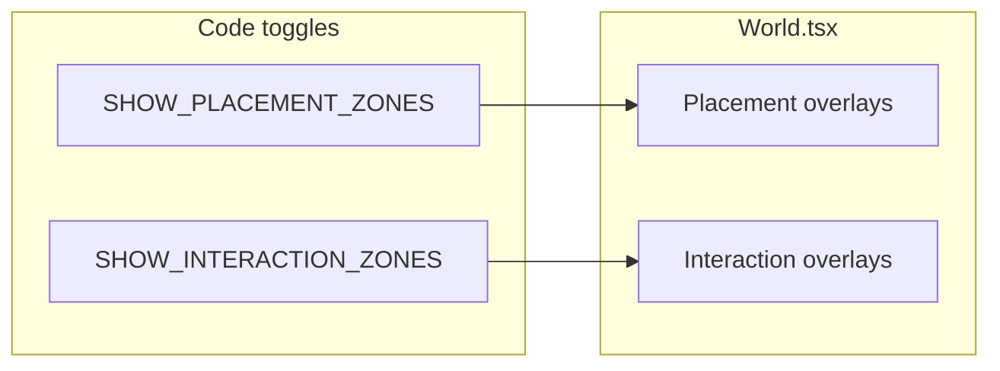

# Grid-snapped zones, item registry, global interaction overlay

## 1. Placement zones: grid alignment

Current values in `[src/systems/placementZones.ts](src/systems/placementZones.ts)` mix aligned positions (e.g. `1344 = 42 * 32`) with **non-multiples of `TILE_SIZE`** (`600`, `2000`), so overlays do not align with the 32px grid.

**Approach:** Express each zone as **tile coordinates** `(col, row, widthInTiles, heightInTiles)` and derive pixels with `* TILE_SIZE` from `[src/constants.ts](src/constants.ts)` (`TILE_SIZE = 32`). That guarantees `x`, `y`, `width`, `height` are all multiples of 32. Keep the same rough layout (crossroads center, four arms) by choosing integer col/row values close to the current world positions (e.g. replace `y: 600` with `19 * 32 = 608` or `18 * 32 = 576` consistently for all arms).

No change needed to `[isInsidePlacementZone](src/systems/placementZones.ts)` beyond the rect values themselves.

## 2. Item definitions registry

Add `[src/data/itemDefinitions.ts](src/data/itemDefinitions.ts)` (or `src/systems/itemDefinitions.ts` if you prefer systems-only imports) defining:

- `ItemDefinition`: `id`, `displayName`, `variants` (string placeholder), `selected_variant` (default `''`), `image` (string URL, default `''`), `color` (CSS color fallback).
- `ITEM_DEFINITIONS`: exactly these `id`s: `resistor`, `capacitor`, `inductor`, `transistor`, `switch`, `bulb`, `wire`.
- Helpers: `getItemDefinition(id)`, `getItemDisplayName(id)` (fallback to `id` if unknown), and optionally `getItemImage(id)` for UI.

Update `[src/systems/gridSystem.ts](src/systems/gridSystem.ts)`: remove the ad-hoc `ITEM_COLORS` map (including `wood`/`stone`/legacy parts) and implement `getItemColor(itemId)` via `getItemDefinition(itemId)?.color ?? '#ff00ff'`.

## 3. Hotbar: display name + image or color

In `[src/components/Hotbar.tsx](src/components/Hotbar.tsx)`:

- Set `title` (and any `aria-label` if you add one) to `**displayName`** from the registry, not raw `itemId`.
- If `image` is non-empty, render an `` (with sensible `alt=""` decorative or `alt={displayName}`) inside the slot; otherwise keep the colored `.item-swatch` using `getItemColor`.

## 4. Empty inventory + session mock aligned to seven items

In `[src/api/sessionApi.ts](src/api/sessionApi.ts)`:

- `defaultInventory()` → `**[]`**.
- Remove `visible` from each puzzle in `defaultPuzzles()` (see section 5).
- Replace rewards/questions that reference removed ids:
  - Puzzle currently rewarding `thyristor` → use `**switch`** (and a question/answer that matches `switch`).
  - Puzzle currently rewarding `diode` → use one of `**bulb`**, `**wire**`, or `**inductor**` with a matching question/answer (all are in the allowed set).

Ensure puzzle **rectangles** are also grid-snapped if you want consistency with the world grid (optional but consistent with placement zones); at minimum align `x`/`y`/`width`/`height` to multiples of 32.

## 5. Interactive zones: global visibility flag

Mirror the pattern of `SHOW_PLACEMENT_ZONES` in `[src/systems/placementZones.ts](src/systems/placementZones.ts)`:

- Add `**SHOW_INTERACTION_ZONES`** (e.g. in `[src/constants.ts](src/constants.ts)` next to the other toggles, or beside placement zones—pick one file and import consistently).

**Remove per-zone visibility from the data model:**

- `[src/api/types.ts](src/api/types.ts)`: drop `visible?: boolean` from `PuzzleConfig`.
- `[src/types/index.ts](src/types/index.ts)`: drop `visible` from `InteractionZone`.
- `[src/store/gameState.ts](src/store/gameState.ts)`: in `puzzlesToZones`, stop mapping `p.visible`; omit `visible` from constructed objects.

**Rendering:**

- `[src/components/World.tsx](src/components/World.tsx)`: replace `.filter((z) => z.visible)` with: if `SHOW_INTERACTION_ZONES`, map **all** `interactionZones`; if false, render none (same UX as placement zone toggle).

## 6. Verification

- Run `npm run build` or `bun run build` (project uses Bun per lockfile) and fix any TypeScript errors from removed `visible` fields.
- Clear `localStorage` key `game_session_*` or use a fresh seed so old saved sessions with `visible` on puzzles do not confuse testing (JSON parse still works; extra fields are ignored if not read).

## Files to touch (summary)

| Area                  | Files                                                                                                            |
| --------------------- | ---------------------------------------------------------------------------------------------------------------- |
| Grid snap             | `[src/systems/placementZones.ts](src/systems/placementZones.ts)`                                                 |
| Item registry + color | new `src/data/itemDefinitions.ts`, `[src/systems/gridSystem.ts](src/systems/gridSystem.ts)`                      |
| Hotbar                | `[src/components/Hotbar.tsx](src/components/Hotbar.tsx)`                                                         |
| API / session         | `[src/api/sessionApi.ts](src/api/sessionApi.ts)`, `[src/api/types.ts](src/api/types.ts)`                         |
| State / types         | `[src/types/index.ts](src/types/index.ts)`, `[src/store/gameState.ts](src/store/gameState.ts)`                   |
| Global IZ flag        | `[src/constants.ts](src/constants.ts)` or placementZones, `[src/components/World.tsx](src/components/World.tsx)` |

