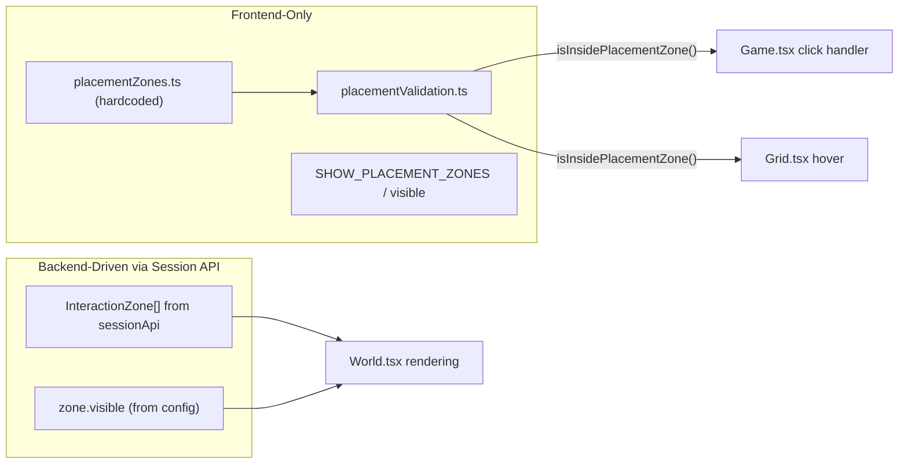

# Placement Zones, Visibility Controls, and Input Fix

## Current State

All files are under `src/`. Placement and hover currently work everywhere on the 3000x3000 grid. Interactive zones have no `visible` field. `useKeyboard` has no blur handler so keys can get "stuck" when the window loses focus. The mock API defines 4 puzzles with wood/stone/brick rewards.

## Architecture: Zone System Separation




---

## New and Modified Files

### New files

- `[src/systems/placementZones.ts](src/systems/placementZones.ts)` -- `PlacementZone` type, hardcoded zone array, `SHOW_PLACEMENT_ZONES` flag, `isInsidePlacementZone()` helper
- `[src/systems/placementValidation.ts](src/systems/placementValidation.ts)` -- `canPlaceAt()` and `canRemoveAt()` combining zone + grid + inventory checks

### Modified files

- `[src/types/index.ts](src/types/index.ts)` -- add `visible` to `InteractionZone`
- `[src/api/types.ts](src/api/types.ts)` -- add `visible` to `PuzzleConfig`
- `[src/api/sessionApi.ts](src/api/sessionApi.ts)` -- replace 4 puzzles with 5 new electronics-themed ones (resistor/capacitor/transistor/thyristor/diode rewards), add `visible` to each
- `[src/systems/gridSystem.ts](src/systems/gridSystem.ts)` -- add item colors for `resistor`, `capacitor`, `transistor`, `thyristor`, `diode`
- `[src/store/gameState.ts](src/store/gameState.ts)` -- map `visible` field when converting puzzles to zones
- `[src/hooks/useKeyboard.ts](src/hooks/useKeyboard.ts)` -- add `blur` + `visibilitychange` listeners to clear all keys
- `[src/components/Game.tsx](src/components/Game.tsx)` -- guard placement/removal with `isInsidePlacementZone`, pass placement zones to World, restrict hover
- `[src/components/Grid.tsx](src/components/Grid.tsx)` -- only show hover highlight inside a placement zone
- `[src/components/World.tsx](src/components/World.tsx)` -- render placement zones (when visible), conditionally render interaction zones based on `zone.visible`
- `[src/styles/game.css](src/styles/game.css)` -- add `.placement-zone` style

---

## Phase 15: Placement Zones System (detailed)

### 1. Create `[src/systems/placementZones.ts](src/systems/placementZones.ts)`

```typescript
export type PlacementZone = {
  id: string
  x: number       // world-space px
  y: number
  width: number
  height: number
}

export const SHOW_PLACEMENT_ZONES = true

export const PLACEMENT_ZONES: PlacementZone[] = [
  { id: 'pz-crossroads', x: 1344, y: 1344, width: 320, height: 320 },
  { id: 'pz-north', x: 1344, y: 600, width: 320, height: 256 },
  { id: 'pz-east', x: 2000, y: 1344, width: 320, height: 320 },
  { id: 'pz-south', x: 1344, y: 2000, width: 320, height: 256 },
  { id: 'pz-west', x: 600, y: 1344, width: 320, height: 320 },
]

export function isInsidePlacementZone(
  worldX: number,
  worldY: number,
): boolean {
  for (const z of PLACEMENT_ZONES) {
    if (
      worldX >= z.x &&
      worldX < z.x + z.width &&
      worldY >= z.y &&
      worldY < z.y + z.height
    ) {
      return true
    }
  }
  return false
}
```

Zones are placed along the crossroads and path areas of the CSS background map. All coordinates snap to TILE_SIZE (32px) boundaries. `SHOW_PLACEMENT_ZONES` is a code-level boolean, not a UI toggle.

### 2. Create `[src/systems/placementValidation.ts](src/systems/placementValidation.ts)`

Pure functions combining all checks for a placement or removal action:

```typescript
import { isValidCell } from './gridSystem'
import { isInsidePlacementZone } from './placementZones'
import { canPlaceItem } from '../systems/inventorySystem'
import { TILE_SIZE } from '../constants'
import type { InventorySlot, Tile } from '../types'

export function canPlaceAt(
  worldX: number,
  worldY: number,
  gridRow: number,
  gridCol: number,
  grid: Tile[][],
  slots: (InventorySlot | null)[],
  activeIndex: number,
): boolean {
  if (!isInsidePlacementZone(worldX, worldY)) return false
  if (!isValidCell(gridRow, gridCol)) return false
  if (grid[gridRow][gridCol].itemId !== null) return false
  if (!canPlaceItem(slots, activeIndex)) return false
  return true
}

export function canRemoveAt(
  worldX: number,
  worldY: number,
  gridRow: number,
  gridCol: number,
  grid: Tile[][],
): boolean {
  if (!isInsidePlacementZone(worldX, worldY)) return false
  if (!isValidCell(gridRow, gridCol)) return false
  if (!grid[gridRow][gridCol].itemId) return false
  return true
}
```

---

## Phase 16: Visibility Toggles (detailed)

### 1. Add `visible` to `InteractionZone` in `[src/types/index.ts](src/types/index.ts)`

The current `InteractionZone` type:

```typescript
export type InteractionZone = {
  id: string
  x: number
  y: number
  width: number
  height: number
  question: string
  correctAnswer: string
  rewardItems: { itemId: string; quantity: number }[]
  solved: boolean
}
```

Add `visible: boolean` after `solved`.

### 2. Add `visible` to `PuzzleConfig` in `[src/api/types.ts](src/api/types.ts)`

Add `visible: boolean` to `PuzzleConfig`.

### 3. Update `[src/store/gameState.ts](src/store/gameState.ts)` `puzzlesToZones`

The existing function maps puzzle fields to zones. Add: `visible: p.visible` to the object literal.

### 4. Update `[src/components/World.tsx](src/components/World.tsx)`

**Interaction zones:** only render the zone indicator div when `zone.visible` is true:

```tsx
{interactionZones.filter(z => z.visible).map((zone) => (
  <div key={zone.id} className={`interaction-zone${zone.solved ? ' solved' : ''}`} ... />
))}
```

The `findActiveZone` logic in Game.tsx does NOT check `visible` -- E key works regardless of visibility (player discovers hidden zones by walking + pressing E).

**Placement zones:** import `PLACEMENT_ZONES` and `SHOW_PLACEMENT_ZONES` from `placementZones.ts`. When `SHOW_PLACEMENT_ZONES` is true, render each zone as a div with class `.placement-zone`:

```tsx
{SHOW_PLACEMENT_ZONES && PLACEMENT_ZONES.map((pz) => (
  <div key={pz.id} className="placement-zone"
    style={{ left: pz.x, top: pz.y, width: pz.width, height: pz.height }}
  />
))}
```

### 5. Add `.placement-zone` CSS in `[src/styles/game.css](src/styles/game.css)`

```css
.placement-zone {
  position: absolute;
  background: rgba(100, 180, 255, 0.08);
  border: 1px dashed rgba(100, 180, 255, 0.25);
  z-index: 2;
  pointer-events: none;
}
```

---

## Phase 17: Hover and Placement Restriction (detailed)

### 1. Modify `[src/components/Grid.tsx](src/components/Grid.tsx)`

Import `isInsidePlacementZone` from `placementZones.ts`. In the hover highlight logic, add the zone check:

Current code:

```typescript
if (hoverWorld) {
  const col = Math.floor(hoverWorld.x / TILE_SIZE)
  const row = Math.floor(hoverWorld.y / TILE_SIZE)
  if (isValidCell(row, col)) {
    hoverHighlight = { left: col * TILE_SIZE, top: row * TILE_SIZE }
  }
}
```

Change to:

```typescript
if (hoverWorld && isInsidePlacementZone(hoverWorld.x, hoverWorld.y)) {
  const col = Math.floor(hoverWorld.x / TILE_SIZE)
  const row = Math.floor(hoverWorld.y / TILE_SIZE)
  if (isValidCell(row, col)) {
    hoverHighlight = { left: col * TILE_SIZE, top: row * TILE_SIZE }
  }
}
```

Remove the separate `inWorld` check since `isInsidePlacementZone` already validates the position is within a defined area.

### 2. Modify `[src/components/Game.tsx](src/components/Game.tsx)` `handleMouseDown`

Replace the current validation with `canPlaceAt` / `canRemoveAt` from `placementValidation.ts`:

**Left click flow:**

1. Compute `worldX`, `worldY`, `gridRow`, `gridCol` (same as now).
2. If cell has item AND `canRemoveAt(worldX, worldY, gridRow, gridCol, grid)`: remove + returnItem + sync.
3. Else if `canPlaceAt(worldX, worldY, gridRow, gridCol, grid, hotbar.slots, hotbar.activeIndex)`: consumeItem + place + sync.
4. Otherwise: do nothing (outside zone).

**Right click:** same removal path using `canRemoveAt`.

This replaces the current `isValidCell` + `canPlaceItem` checks with the consolidated validation that includes the zone check.

---

## Phase 18: Keyboard Blur Fix (detailed)

### Modify `[src/hooks/useKeyboard.ts](src/hooks/useKeyboard.ts)`

Add a `resetKeys` function that clears the ref. Register it on:

- `blur` (window loses focus)
- `visibilitychange` (tab switch, minimize)

```typescript
const resetKeys = () => {
  keys.current = {}
}

window.addEventListener('blur', resetKeys)
document.addEventListener('visibilitychange', () => {
  if (document.hidden) resetKeys()
})
```

Clean up all listeners on unmount. This prevents WASD from getting "stuck" when the user alt-tabs or clicks outside the window.

---

## Phase 19: Updated Mock Puzzle Zones (detailed)

### Modify `[src/api/sessionApi.ts](src/api/sessionApi.ts)` `defaultPuzzles()`

Replace the current 4 puzzles with 5 new ones matching the user's spec. Each reward gives component-type items instead of wood/stone/brick:

```typescript
[
  {
    id: 'z1', x: 400, y: 300, width: 100, height: 100,
    visible: true,
    question: 'I resist current. What am I?',
    correctAnswer: 'resistor',
    rewardItems: [{ itemId: 'resistor', quantity: 2 }],
  },
  {
    id: 'z2', x: 800, y: 600, width: 120, height: 120,
    visible: false,
    question: 'I store electric charge. What am I?',
    correctAnswer: 'capacitor',
    rewardItems: [{ itemId: 'capacitor', quantity: 2 }],
  },
  {
    id: 'z3', x: 1200, y: 500, width: 100, height: 100,
    visible: true,
    question: 'I amplify signals. What am I?',
    correctAnswer: 'transistor',
    rewardItems: [{ itemId: 'transistor', quantity: 2 }],
  },
  {
    id: 'z4', x: 2000, y: 1000, width: 150, height: 150,
    visible: false,
    question: 'I control power like a switch. What am I?',
    correctAnswer: 'thyristor',
    rewardItems: [{ itemId: 'thyristor', quantity: 2 }],
  },
  {
    id: 'z5', x: 2500, y: 2000, width: 100, height: 100,
    visible: true,
    question: 'I allow current one way. What am I?',
    correctAnswer: 'diode',
    rewardItems: [{ itemId: 'diode', quantity: 2 }],
  },
]
```

### Update `defaultInventory()` in the same file

Change initial inventory to component types:

```typescript
[
  { itemId: 'resistor', quantity: 2 },
  { itemId: 'capacitor', quantity: 2 },
  { itemId: 'transistor', quantity: 1 },
]
```

### Add item colors in `[src/systems/gridSystem.ts](src/systems/gridSystem.ts)`

Expand `ITEM_COLORS`:

```typescript
const ITEM_COLORS: Record<string, string> = {
  wood: '#8B4513',
  stone: '#808080',
  brick: '#B22222',
  resistor: '#e6a846',
  capacitor: '#5b9bd5',
  transistor: '#70ad47',
  thyristor: '#c55a11',
  diode: '#7030a0',
}
```

---

## Implementation Order

1. **Phase 15** -- Placement zones + validation (foundation)
2. **Phase 16** -- Visibility toggles for both zone types
3. **Phase 17** -- Restrict hover + placement to zones (uses Phase 15)
4. **Phase 18** -- Keyboard blur fix (independent)
5. **Phase 19** -- New puzzle data + item colors (independent)

Note: existing sessions stored in localStorage will have the old puzzle IDs. Starting a new session (new code) will use the updated data. Old sessions resume with their saved state.