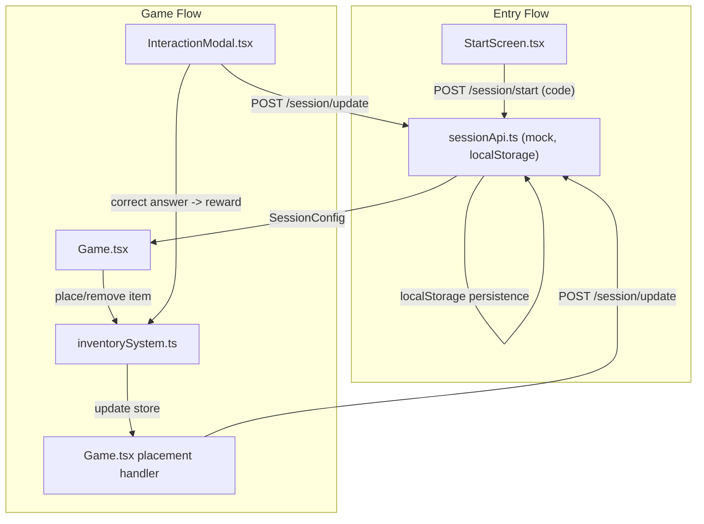
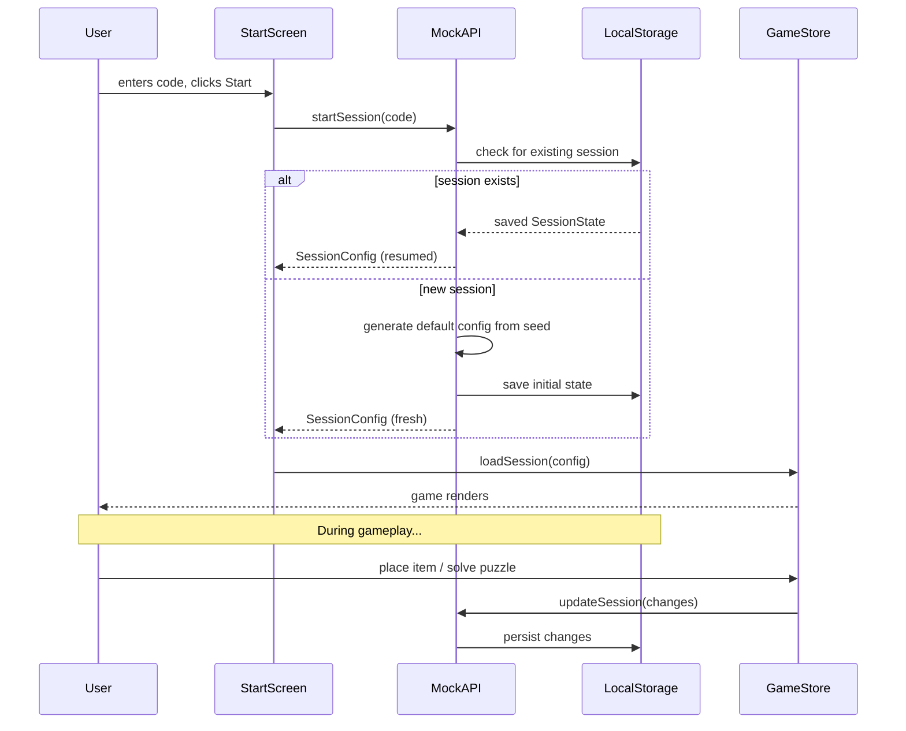

# Session, Inventory, Puzzles, and Background Map

## Current State

The game engine from Phase 1 is fully working: WASD movement, camera scrolling, grid placement/removal, hotbar selection, and interaction modals. All code is under `src/`. The hotbar currently uses `slots: (string | null)[]` with no quantity tracking, puzzles have no answer validation, and there is no session or API layer.

## Architecture Changes




## Data Flow: Session Resume

When a user enters the same code again after a disconnect, the mock API returns the **previously saved state** from localStorage. The frontend hydrates the Zustand store with that state and the game continues from where the user left off.




---

## New and Modified Files

### New Files


| File                                 | Purpose                                                          |
| ------------------------------------ | ---------------------------------------------------------------- |
| `src/api/sessionApi.ts`              | Mock API (startSession, updateSession), localStorage persistence |
| `src/api/types.ts`                   | SessionConfig, SessionUpdate, PuzzleConfig types                 |
| `src/components/StartScreen.tsx`     | Main menu with code input and Start button                       |
| `src/systems/inventorySystem.ts`     | Stack-based inventory logic (consume, return, canPlace)          |
| `src/components/WorldBackground.tsx` | CSS-only handcrafted map background                              |


### Modified Files


| File                                  | Changes                                                                                                 |
| ------------------------------------- | ------------------------------------------------------------------------------------------------------- |
| `src/types/index.ts`                  | New `InventorySlot` type, update `Hotbar`, expand `InteractionZone`, add `GameState` fields for session |
| `src/store/gameState.ts`              | `loadSession` action, inventory actions (consumeItem, returnItem), solvedZones tracking                 |
| `src/App.tsx`                         | Route between StartScreen and Game based on session state                                               |
| `src/components/Game.tsx`             | Inventory-aware placement/removal, API sync calls after mutations                                       |
| `src/components/Hotbar.tsx`           | Display quantity badge on each slot                                                                     |
| `src/components/InteractionModal.tsx` | Answer validation, reward items on correct, mark zone solved                                            |
| `src/components/World.tsx`            | Render WorldBackground, use session-driven zones                                                        |
| `src/styles/game.css`                 | Start screen styles, quantity badge, map background layers                                              |
| `src/constants.ts`                    | Add `MAX_STACK_SIZE = 5`                                                                                |


---

## Phase 7: Start Screen (detailed)

### 1. Create `[src/components/StartScreen.tsx](src/components/StartScreen.tsx)`

State:

- `code: string` -- controlled input
- `loading: boolean` -- while calling mock API
- `error: string | null` -- if API fails

Render:

- Full-viewport centered card (dark theme matching the game)
- Title: "Grid Game"
- Helper text: "Enter session code"
- Text input for the code
- "Start" button
- Error message display

Props:

```typescript
type StartScreenProps = {
  onSessionStart: (config: SessionConfig) => void
}
```

Behavior:

- On clicking Start (or pressing Enter):
  1. Set `loading = true`
  2. Call `startSession(code)` from `sessionApi.ts`
  3. On success: call `onSessionStart(config)`
  4. On error: set `error` message

### 2. Modify `[src/App.tsx](src/App.tsx)`

Add a `screen` state: `'start' | 'game'`.

```typescript
const [screen, setScreen] = useState<'start' | 'game'>('start')
const [sessionConfig, setSessionConfig] = useState<SessionConfig | null>(null)
```

- When `screen === 'start'`: render `<StartScreen onSessionStart={...} />`
- On session start callback: store config, call `useGameStore.getState().loadSession(config)`, set `screen = 'game'`
- When `screen === 'game'`: render `<Game />`

### 3. Start screen CSS in `[src/styles/game.css](src/styles/game.css)`

```css
.start-screen {
  width: 100vw;
  height: 100vh;
  display: flex;
  align-items: center;
  justify-content: center;
  background: #1a1a2e;
  color: #fff;
  font-family: system-ui, sans-serif;
}

.start-card {
  background: #2a2a3e;
  padding: 48px;
  border-radius: 16px;
  text-align: center;
  min-width: 360px;
}

.start-card h1 { margin-bottom: 8px; font-size: 32px; }
.start-card p { opacity: 0.6; margin-bottom: 24px; }

.start-card input {
  width: 100%;
  padding: 10px 14px;
  border: 1px solid rgba(255,255,255,0.2);
  border-radius: 8px;
  background: rgba(0,0,0,0.3);
  color: #fff;
  font-size: 16px;
  margin-bottom: 16px;
}

.start-card button {
  width: 100%;
  padding: 12px;
  border: none;
  border-radius: 8px;
  background: #4a9eff;
  color: #fff;
  font-size: 16px;
  cursor: pointer;
}

.start-card button:disabled { opacity: 0.5; cursor: not-allowed; }
.start-error { color: #ff6b6b; margin-top: 12px; font-size: 14px; }
```

---

## Phase 8: Mock Session API (detailed)

### 1. Create `[src/api/types.ts](src/api/types.ts)`

```typescript
export type PuzzleConfig = {
  id: string
  x: number
  y: number
  width: number
  height: number
  question: string
  correctAnswer: string
  rewardItems: { itemId: string; quantity: number }[]
}

export type InventorySlotConfig = {
  itemId: string
  quantity: number
}

export type PlacedItem = {
  row: number
  col: number
  itemId: string
}

export type SessionConfig = {
  sessionId: string
  seed: string
  worldWidth: number
  worldHeight: number
  playerStart: { x: number; y: number }
  puzzles: PuzzleConfig[]
  inventory: InventorySlotConfig[]
  placedItems: PlacedItem[]
  solvedPuzzleIds: string[]
}

export type SessionUpdate = {
  sessionId: string
  inventory?: InventorySlotConfig[]
  placedItems?: PlacedItem[]
  solvedPuzzleIds?: string[]
}
```

### 2. Create `[src/api/sessionApi.ts](src/api/sessionApi.ts)`

This is a pure TypeScript module with no React. It simulates a backend using **localStorage** so sessions persist across page reloads and reconnections.

Storage key: `"game_session_" + code`

`**startSession(code: string): Promise<SessionConfig>`**

1. Check localStorage for key `"game_session_" + code`.
2. If found: parse and return the saved `SessionConfig` (resume).
3. If not found: generate a default config seeded by the code:
  - `sessionId`: random UUID or derived from code
  - `worldWidth / worldHeight`: from constants (3000)
  - `playerStart`: `{ x: 1500, y: 1500 }`
  - `puzzles`: array of 3-4 hardcoded electronics-themed puzzles:
    - "What two-terminal device stores energy in an electric field?" -> "capacitor", reward: `[{itemId: "stone", quantity: 2}]`
    - "What semiconductor device acts as a switch or amplifier?" -> "transistor", reward: `[{itemId: "brick", quantity: 2}]`
    - "What passive component opposes current flow?" -> "resistor", reward: `[{itemId: "wood", quantity: 3}]`
    - "What component allows current in one direction only?" -> "diode", reward: `[{itemId: "stone", quantity: 1}]`
  - `inventory`: `[{itemId: "wood", quantity: 3}, {itemId: "stone", quantity: 2}, {itemId: "brick", quantity: 2}]`
  - `placedItems`: `[]`
  - `solvedPuzzleIds`: `[]`
4. Save the new config to localStorage.
5. Return the config.

`**updateSession(update: SessionUpdate): Promise<void>`**

1. Read existing session from localStorage using `update.sessionId`.
2. Merge the update fields (`inventory`, `placedItems`, `solvedPuzzleIds`) into the stored config.
3. Write back to localStorage.

Both functions return Promises (simulating async API calls), resolved via `Promise.resolve()` or with a small artificial delay if desired.

---

## Phase 9: Stackable Inventory System (detailed)

### 1. Update types in `[src/types/index.ts](src/types/index.ts)`

Replace the current `Hotbar` type:

```typescript
// OLD
export type Hotbar = {
  slots: (string | null)[]
  activeIndex: number
}

// NEW
export type InventorySlot = {
  itemId: string
  quantity: number   // 1-5
}

export type Hotbar = {
  slots: (InventorySlot | null)[]   // 8 slots
  activeIndex: number
}
```

Update `InteractionZone` to include puzzle data:

```typescript
export type InteractionZone = {
  id: string
  x: number
  y: number
  width: number
  height: number
  question: string
  correctAnswer: string
  rewardItems: { itemId: string; quantity: number }[]
  solved: boolean
}
```

Add to `GameState`:

```typescript
sessionId: string | null
solvedPuzzleIds: string[]

// New actions
loadSession: (config: SessionConfig) => void
consumeItem: (slotIndex: number) => boolean     // returns false if slot empty
returnItem: (itemId: string) => boolean          // returns false if no room
markZoneSolved: (zoneId: string) => void
addRewardItems: (items: { itemId: string; quantity: number }[]) => void
```

### 2. Add to `[src/constants.ts](src/constants.ts)`

```typescript
export const MAX_STACK_SIZE = 5
```

### 3. Create `[src/systems/inventorySystem.ts](src/systems/inventorySystem.ts)`

Pure functions:

`**consumeFromSlot(slots: (InventorySlot | null)[], index: number): (InventorySlot | null)[]**`

- If slot is null or quantity is 0: return unchanged.
- Decrement quantity by 1.
- If quantity reaches 0: set slot to null.
- Return new slots array.

`**returnToInventory(slots: (InventorySlot | null)[], itemId: string): (InventorySlot | null)[]**`

- Find first slot with matching `itemId` and `quantity < MAX_STACK_SIZE`. If found: increment quantity, return.
- Else find first null slot. If found: set it to `{ itemId, quantity: 1 }`, return.
- Else: return unchanged (inventory full -- item is lost, or prevent removal).

`**canPlaceItem(slots: (InventorySlot | null)[], index: number): boolean**`

- Return `slots[index] !== null && slots[index].quantity > 0`.

`**addItems(slots: (InventorySlot | null)[], items: { itemId: string; quantity: number }[]): (InventorySlot | null)[]**`

- For each reward item, iterate quantity times and call `returnToInventory` logic.
- Return updated slots.

### 4. Update `[src/store/gameState.ts](src/store/gameState.ts)`

**Initial state changes:**

- `hotbar.slots` becomes `[{ itemId: 'wood', quantity: 3 }, { itemId: 'stone', quantity: 2 }, { itemId: 'brick', quantity: 2 }, null, null, null, null, null]`
- Add `sessionId: null` and `solvedPuzzleIds: []`

**New action: `loadSession(config)`**

- Set `player` position from `config.playerStart`
- Convert `config.inventory` to hotbar slots (map each `InventorySlotConfig` to `InventorySlot`, pad with nulls to 8)
- Rebuild `grid` from `config.placedItems` (start with empty grid, set each placed item)
- Convert `config.puzzles` to `InteractionZone[]` (map fields, set `solved: config.solvedPuzzleIds.includes(id)`)
- Set `sessionId`, `solvedPuzzleIds`
- Set camera to `{ x: 0, y: 0 }`

**New action: `consumeItem(slotIndex)`**

- Call `consumeFromSlot(state.hotbar.slots, slotIndex)`
- Update `hotbar.slots`

**New action: `returnItem(itemId)`**

- Call `returnToInventory(state.hotbar.slots, itemId)`
- Update `hotbar.slots`

**New action: `markZoneSolved(zoneId)`**

- Add `zoneId` to `solvedPuzzleIds`
- Update the matching zone in `interactionZones` to `solved: true`

**New action: `addRewardItems(items)`**

- Call `addItems(state.hotbar.slots, items)`
- Update `hotbar.slots`

---

## Phase 10: Placement/Removal with Inventory Sync (detailed)

### Modify `[src/components/Game.tsx](src/components/Game.tsx)` `handleMouseDown`

**Current flow (left click):**

1. If cell has item: remove it from grid.
2. Else if hotbar slot has item: place it on grid.

**New flow (left click):**

1. If cell has item:
  - Remove from grid via `setGrid(removeItem(...))`
  - Return item to inventory via `returnItem(cell.itemId)`
  - Call `syncToApi()` (see below)
2. Else if active hotbar slot has item with `quantity > 0`:
  - Place on grid via `setGrid(placeItem(...))`
  - Consume from inventory via `consumeItem(hotbar.activeIndex)`
  - Call `syncToApi()`

**Right-click:** same as left-click removal path.

`**syncToApi()` helper** (defined in Game.tsx or extracted):

```typescript
async function syncToApi() {
  const { sessionId, hotbar, grid, solvedPuzzleIds } = useGameStore.getState()
  if (!sessionId) return

  const inventory = hotbar.slots
    .filter((s): s is InventorySlot => s !== null)
    .map(s => ({ itemId: s.itemId, quantity: s.quantity }))

  const placedItems: PlacedItem[] = []
  for (let r = 0; r < grid.length; r++) {
    for (let c = 0; c < grid[r].length; c++) {
      if (grid[r][c].itemId) {
        placedItems.push({ row: r, col: c, itemId: grid[r][c].itemId! })
      }
    }
  }

  await updateSession({ sessionId, inventory, placedItems, solvedPuzzleIds })
}
```

Note: `syncToApi` runs asynchronously in the background. UI updates are immediate (optimistic). Errors from the mock API are silently ignored for now.

---

## Phase 11: CSS Background Map (detailed)

### 1. Create `[src/components/WorldBackground.tsx](src/components/WorldBackground.tsx)`

A purely visual component rendered inside `World.tsx` as the bottom layer. Uses absolutely-positioned divs with CSS colors/borders to create a placeholder map.

Layout concept (all coordinates in world-space pixels):

- **Ground** (full 3000x3000): dark green `#2d5016`
- **Path areas** (horizontal + vertical strips): lighter dirt color `#8B7355`
  - Horizontal path: y=1400..1600, full width
  - Vertical path: x=1400..1600, full height
- **Water body** (top-right area): blue `#1a4a6e`
  - x=2200, y=200, 600x400
- **Rocky zone** (bottom-left): gray `#4a4a4a`
  - x=100, y=2200, 500x500
- **Puzzle zone visual markers**: already rendered as `.interaction-zone` divs
- **Boundary walls** (4 edges): slightly darker border divs

The component returns a fragment of `<div>` elements with inline styles for position/size/color. No props needed -- it reads constants for dimensions.

### 2. Modify `[src/components/World.tsx](src/components/World.tsx)`

Insert `<WorldBackground />` as the first child inside the `.world` div (before zones, grid, player), so it renders behind everything.

### 3. Add to `[src/styles/game.css](src/styles/game.css)`

```css
.world-bg-layer {
  position: absolute;
  inset: 0;
  z-index: 0;
}

.world-bg-layer div {
  position: absolute;
  pointer-events: none;
}
```

Remove or override the `.game-container` solid `background: #1a1a2e` -- the world background handles the ground color now. Keep `#1a1a2e` as a fallback for areas outside the world bounds.

---

## Phase 12: Config-Driven Puzzle Zones with Answer Validation (detailed)

### 1. Modify `[src/components/InteractionModal.tsx](src/components/InteractionModal.tsx)`

The modal already has the question, input, and submit button. Changes:

**On submit:**

1. Compare `answer.trim().toLowerCase()` to `activeModal.correctAnswer.toLowerCase()`.
2. If correct:
  - Call `markZoneSolved(activeModal.id)` on the store
  - Call `addRewardItems(activeModal.rewardItems)` on the store
  - Show a brief "Correct!" feedback (set local state `feedback: 'correct'`)
  - Call `syncToApi()` to persist
  - Close modal after a short delay (500ms) or on next click
3. If incorrect:
  - Show "Try again" feedback (set local state `feedback: 'wrong'`)
  - Do not close modal, let user retry

**If zone is already solved:**

- The `InteractionModal` should show a "completed" state: display the question and answer, no input, just a "Close" button.

**Escape key still closes the modal without answering.**

### 2. Update zone rendering in `[src/components/World.tsx](src/components/World.tsx)`

- Solved zones get a different visual style: green-tinted instead of yellow.
- Add a CSS class `.interaction-zone.solved` with green colors.

### 3. Handle E key for solved zones in `[src/components/Game.tsx](src/components/Game.tsx)`

Currently any zone opens the modal. Keep this behavior -- the modal itself handles showing the "already solved" state. The user can press E on a solved zone and see their answer.

---

## Phase 13: Hotbar Quantity Display (detailed)

### Modify `[src/components/Hotbar.tsx](src/components/Hotbar.tsx)`

Each slot now renders an `InventorySlot | null`. Changes:

- If slot is not null, show:
  - The colored swatch (existing)
  - A quantity badge in the bottom-right corner: `<span className="slot-quantity">{slot.quantity}</span>`
- If slot is null: show empty (existing behavior)
- The active slot check works the same (`hotbar.activeIndex`)

### Add CSS for quantity badge in `[src/styles/game.css](src/styles/game.css)`

```css
.slot-quantity {
  position: absolute;
  bottom: 2px;
  right: 4px;
  font-size: 11px;
  font-weight: bold;
  color: #fff;
  text-shadow: 0 1px 2px rgba(0,0,0,0.8);
  pointer-events: none;
}
```

---

## Phase 14: Session Sync and Resume (detailed)

### `syncToApi` placement

Define `syncToApi` as a standalone async function in `[src/api/sessionApi.ts](src/api/sessionApi.ts)` or as a helper imported by `Game.tsx`. It reads the current store state, serializes inventory + placedItems + solvedPuzzleIds, and calls `updateSession(...)`.

### Call sites for `syncToApi`

1. **After item placement** (in `handleMouseDown`, after `setGrid` + `consumeItem`)
2. **After item removal** (in `handleMouseDown`, after `setGrid` + `returnItem`)
3. **After puzzle solved** (in `InteractionModal`, after `markZoneSolved` + `addRewardItems`)

All calls are fire-and-forget (no `await` blocking UI).

### Resume flow

When `startSession(code)` finds an existing session in localStorage, the returned `SessionConfig` includes:

- `placedItems`: all items currently on the grid
- `inventory`: current stack quantities
- `solvedPuzzleIds`: which puzzles are done

`loadSession(config)` in the store rebuilds the full game state from this data. The user continues exactly where they left off.

---

## Implementation Order

The phases should be built in this order due to dependencies:

1. **Phase 8** -- API types and mock session API (foundation for everything else)
2. **Phase 9** -- Inventory system types + pure functions (needed before modifying Game.tsx)
3. **Phase 7** -- Start screen (needs API to call, loads session into store)
4. **Phase 10** -- Placement/removal with inventory sync (uses new inventory + API)
5. **Phase 13** -- Hotbar quantity display (uses new InventorySlot type)
6. **Phase 11** -- CSS background map (independent, visual only)
7. **Phase 12** -- Puzzle answer validation + rewards (uses inventory + API)
8. **Phase 14** -- Wire up all sync calls, verify resume works end-to-end

