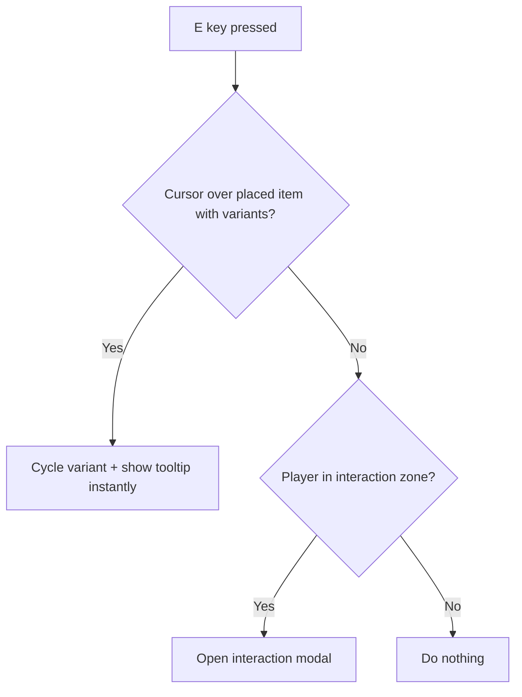

# Variant cycling on placed items with tooltips

## Data model: add `variant` to tiles

Currently `Tile` is just `{ itemId: string | null }`. Every placed tile needs to track its selected variant.

**[src/types/index.ts](src/types/index.ts)** -- add `variant` to `Tile`:

```typescript
export type Tile = {
  itemId: string | null
  variant: string
}
```

Also add to `GameState`:

```typescript
cycleVariant: (row: number, col: number) => boolean
variantJustCycledCell: { row: number; col: number } | null
clearVariantJustCycled: () => void
```

**[src/api/types.ts](src/api/types.ts)** -- add `variant` to `PlacedItem`:

```typescript
export type PlacedItem = {
  row: number
  col: number
  itemId: string
  variant?: string
}
```

## Grid system: handle variant field

**[src/systems/gridSystem.ts](src/systems/gridSystem.ts)** -- update `placeItem` and `removeItem` so new tiles carry `variant: ''` (default). The empty-cell constant becomes `{ itemId: null, variant: '' }`.

## Store: `cycleVariant` action + grid init fix

**[src/store/gameState.ts](src/store/gameState.ts)**:

- `createEmptyGrid()`: tiles become `{ itemId: null, variant: '' }`.
- `applyPlacedItems`: read `variant` from saved placed items.
- New `cycleVariant(row, col)` action: looks up the tile's `itemId`, calls `getItemVariantOptions(itemId)`. If options exist, advance `variant` to the next option (wrap around). Also sets `variantJustCycledCell: { row, col }`. Returns `true` if cycled.
- New `clearVariantJustCycled()` action.
- `placeItem` calls should set variant to the first variant option of the item (or `''` if none).

## E-key priority logic

**[src/components/Game.tsx](src/components/Game.tsx)** -- in the `keydown` handler for `'e'`:

```
1. If hoverWorld points to a grid cell that has a placed item WITH variants:
   -> call state.cycleVariant(row, col)
   -> preventDefault, return  (modal does NOT open)
2. Otherwise (no item, item has no variants, cursor outside placement zone):
   -> existing behaviour: findActiveZone -> setActiveModal
```

The `hoverWorld` state is already tracked in Game.tsx. Converting to grid coords uses the existing `worldToGrid` from `useMouse`, plus checking `grid[row][col].itemId` and `getItemVariantOptions`.




## Tooltip on placed items

**[src/components/Grid.tsx](src/components/Grid.tsx)** -- add local tooltip state:

- Derive `hoveredItemCell` from `hoverWorld` each render (the cell under the cursor that has an item placed).
- Use a `useRef` timer: when `hoveredItemCell` changes to a new occupied cell, start a 500ms timeout. When it fires, set `tooltipCell` state to that cell. When cursor leaves (hoveredItemCell changes to null or different cell), clear timeout and hide tooltip.
- Also subscribe to `variantJustCycledCell` from the store: when it becomes non-null AND matches the current hoveredItemCell, show tooltip instantly (no delay), then call `clearVariantJustCycled()`.
- Render a positioned `<div class="item-tooltip">` at the tile's world position (offset above the tile). Text: `"Resistor (10ohm)"` or just `"Bulb"` if variant is empty. Use `getItemDisplayName` + tile variant.

## Session persistence

**[src/api/sessionApi.ts](src/api/sessionApi.ts)** -- in `buildSessionSyncSnapshot`, include `variant` when building `placedItems`:

```typescript
if (id) placedItems.push({ row: r, col: c, itemId: id, variant: grid[r][c].variant || undefined })
```

## CSS

**[src/styles/game.css](src/styles/game.css)** -- add `.item-tooltip`:

```css
.item-tooltip {
  position: absolute;
  z-index: 15;
  pointer-events: none;
  background: rgba(0, 0, 0, 0.85);
  color: #fff;
  font-size: 12px;
  padding: 4px 8px;
  border-radius: 4px;
  white-space: nowrap;
  transform: translateX(-50%);
}
```

Positioned at `left: col * TILE_SIZE + TILE_SIZE / 2` (centered), `top: row * TILE_SIZE - 28` (above the tile).

## Files summary

- [src/types/index.ts](src/types/index.ts) -- `Tile.variant`, new GameState actions
- [src/api/types.ts](src/api/types.ts) -- `PlacedItem.variant`
- [src/systems/gridSystem.ts](src/systems/gridSystem.ts) -- variant in placeItem/removeItem
- [src/store/gameState.ts](src/store/gameState.ts) -- `cycleVariant`, `variantJustCycledCell`, grid init
- [src/components/Game.tsx](src/components/Game.tsx) -- E-key priority
- [src/components/Grid.tsx](src/components/Grid.tsx) -- tooltip (delay, instant-on-cycle, render)
- [src/api/sessionApi.ts](src/api/sessionApi.ts) -- variant in snapshot
- [src/styles/game.css](src/styles/game.css) -- tooltip style

